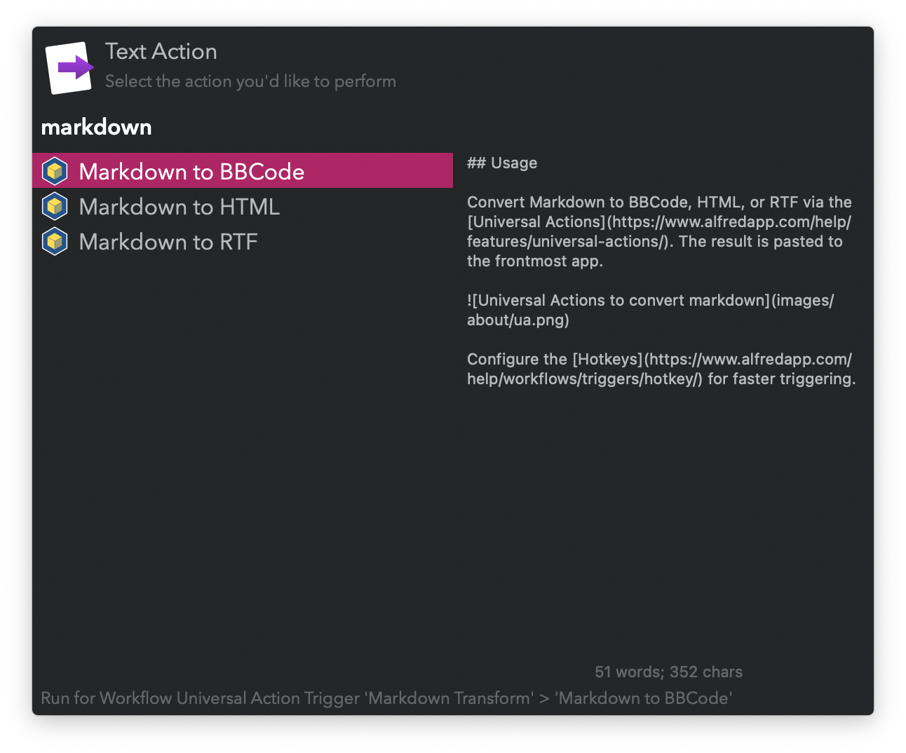

#  Markdown Transform Alfred Workflow

Convert Markdown to BBCode, HTML, and RTF

[⤓ Install on the Alfred Gallery](https://alfred.app/workflows/vitor/markdown-transform)

## Usage

Convert Markdown to BBCode, HTML, or RTF via the [Universal Actions](https://www.alfredapp.com/help/features/universal-actions/). The result is pasted to the frontmost app.

Configure the [Hotkeys](https://www.alfredapp.com/help/workflows/triggers/hotkey/) for faster triggering.
